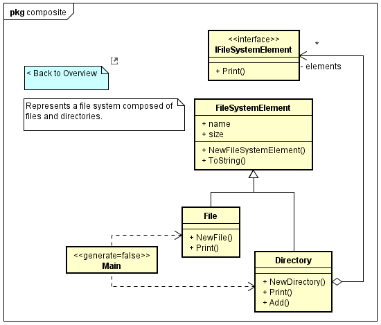
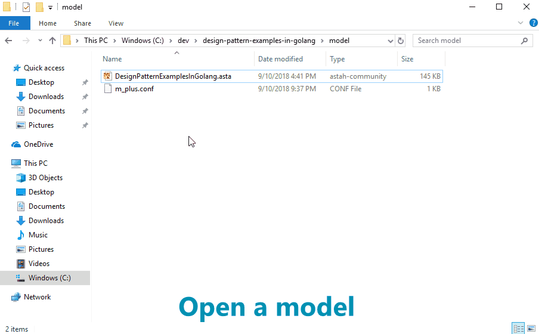

[](https://raw.githubusercontent.com/takaakit/design-pattern-examples-in-golang/master/screenshots/DiagramMap.svg)

Design Pattern Examples in Golang
===

Model and code examples of GoF Design Patterns for Golang.  
This project is available for the following objectives:  

* To try Model-Driven Development (MDD) using Astah and M PLUS plug-in.
* To understand the mapping between UML model and Golang code.
* To understand GoF Design Pattern examples in Golang.  
  etc.

> UML model example:



> Golang code example:

```golang:File class
// ˅
package main

import "fmt"

// ˄

type File struct {
	// ˅

	// ˄

	FileSystemElement

	// ˅

	// ˄
}

func NewFile(name string, size int) *File {
	// ˅
	file := &File{}
	file.FileSystemElement = *NewFileSystemElement(name, size)
	return file
	// ˄
}

// Print this element with the "upperPath".
func (self *File) Print(upperPath string) {
	// ˅
	fmt.Println(upperPath + "/" + self.ToString())
	// ˄
}

// ˅

// ˄
```

Installation
------------
**Astah**
* Download Astah UML or Professional from [Change Vision site](http://astah.net/download), and install.  

**M PLUS plug-in**
* Download the plug-in from [M PLUS plug-in site](https://sites.google.com/view/m-plus-plugin/download), and install.  
  **Use ver.2.2 or higher.**

**Development Environment for Golang**
* Download and install [Golang](https://golang.org/dl/) ver.1.16 or higher.
* Download and install [VS Code](https://code.visualstudio.com/download).  
* Install [Golang extension](https://marketplace.visualstudio.com/items?itemName=ms-vscode.Go) for VS Code.
* Install the [Walk library](https://github.com/lxn/walk).

Usage
-----
* Select model elements on the model browser of Astah, and press the "Generate code" button to generate.  
* The generated code has "User Code Area". The "User Code Area" is the area enclosed by "˅" and "˄". Handwritten code written in the "User Code Area" remains after a re-generation.
* You can run the program from "main.go" for each Design Pattern.
* For detailed usage of the tools, please see [Astah Manual](http://astah.net/manual) and [M PLUS plug-in Tips](https://sites.google.com/view/m-plus-plugin/tips).



References
----------
* Gamma, E. et al. Design Patterns: Elements of Reusable Object-Oriented Software, Addison-Wesley, 1994
* Hiroshi Yuki. Learning Design Patterns in Java [In Japanese Language], Softbank publishing, 2004

Licence
-------
This project is licensed under the Creative Commons Zero (CC0) license. The model and code are completely free to use.

[](http://creativecommons.org/publicdomain/zero/1.0/deed)
