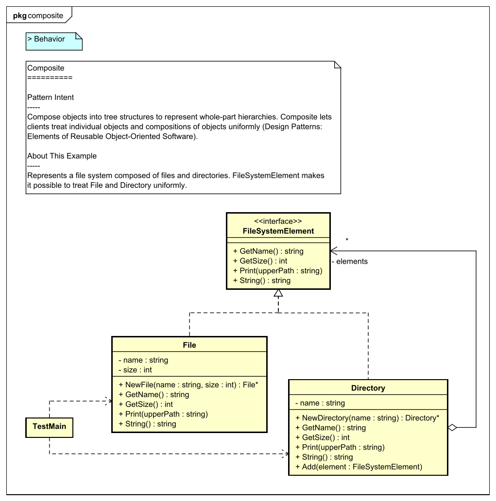
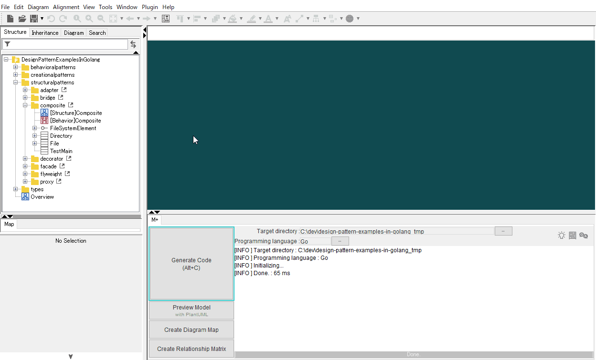
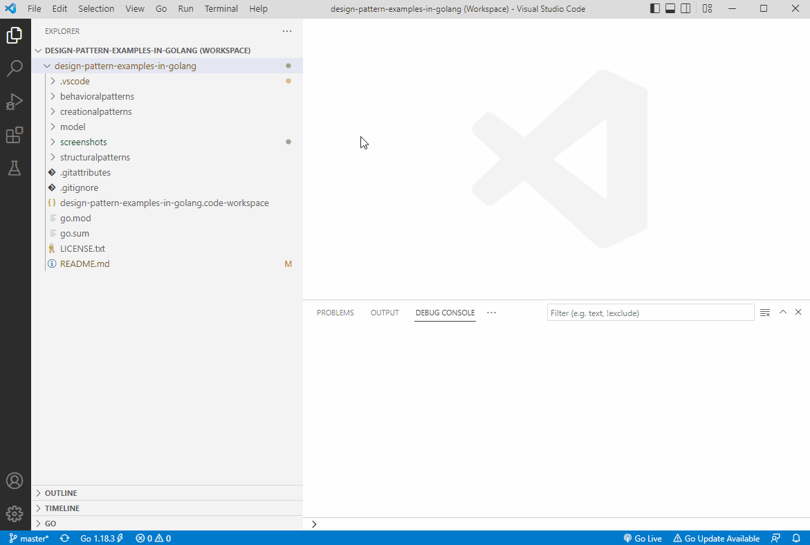

[](https://raw.githubusercontent.com/takaakit/design-pattern-examples-in-golang/master/screenshots/AllPatterns.svg)

Design Pattern Examples in Golang
===

Model and code examples of GoF Design Patterns for Golang.  
This project is available for the following objectives:  

* To understand GoF Design Pattern examples in Golang.
* To understand the mapping between UML model and Golang code.
* To try model-driven development (MDD) using Astah and m plus plug-in.

> UML model example:



<a id="code-example"></a>
> Golang code example:

```go
// ˅
package bridge

import (
	"fmt"
	"strconv"
)

// ˄

type File struct {
	// ˅

	// ˄

	name string

	size int

	// ˅

	// ˄
}

func NewFile(name string, size int) *File {
	// ˅
	return &File{name: name, size: size}
	// ˄
}

func (f *File) GetName() string {
	// ˅
	return f.name
	// ˄
}

func (f *File) GetSize() int {
	// ˅
	return f.size
	// ˄
}

// Print this element with the "upperPath".
func (f *File) Print(upperPath string) {
	// ˅
	fmt.Println(upperPath + "/" + f.String())
	// ˄
}

func (f *File) String() string {
	// ˅
	return f.GetName() + " (" + strconv.Itoa(f.GetSize()) + ")"
	// ˄
}

// ˅

// ˄
```

Installation on Windows
------------
This project uses the [Walk library](https://github.com/lxn/walk), which works only on Windows.

**UML Modeling Tool**
* Download the modeling tool [Astah](https://astah.net/download) UML/Professional **ver.10.0.0** or higher, and install.  
* Download [m plus](https://sites.google.com/view/m-plus-plugin/download) plug-in **ver.3.1.3-preview.1** or higher, and add it to Astah.  
  [How to add plugins to Astah](https://astahblog.com/2014/12/15/astah_plugins/)

**Golang Development Environment**
* Install [Golang](https://golang.org/dl/) **ver.1.24.3** or higher.
* Run `go get github.com/go-delve/delve/cmd/dlv@latest` to install [delve](https://github.com/derekparker/delve/blob/master/Documentation/installation/README.md).
* Run `go get github.com/lxn/walk@latest` to install [Walk library](https://github.com/lxn/walk).
* Install [VS Code](https://code.visualstudio.com/download), add [Golang extension](https://marketplace.visualstudio.com/items?itemName=ms-vscode.Go).
* Launch VS Code. Click **View -> Command Pallete (Ctrl+Shift+P)** and run `> Go: Install/Update Tools`. Check all dependencies and click OK.

Usage on Windows
-----
This project uses the [Walk library](https://github.com/lxn/walk), which works only on Windows.

**Code Generation from UML**
  1. Open the Astah file (model/DesignPatternExamplesInGolang.asta).
  2. Select model elements on the model browser of Astah.
  3. Click the **Generate Code** button.  
    
  The generated code has **User Code Area**. The User Code Area is the area enclosed by "˅" and "˄". Handwritten code written in the User Code Area remains after a re-generation. [View code example](#code-example).  
  For detailed usage of the tools, please see [Astah Manual](https://astah.net/manual) and [m plus plug-in tips](https://sites.google.com/view/m-plus-plugin-tips).

**Run (as a test run)**
  1. Open the workspace file (design-pattern-examples-in-golang.code-workspace) in VS Code.
  2. Open `main_test.go` for the pattern you want to run, and click **Run > Start Debugging** (or press F5).  
       

References
----------
* Gamma, E. et al. Design Patterns: Elements of Reusable Object-Oriented Software, Addison-Wesley, 1994
* Hiroshi Yuki. Learning Design Patterns in Java [In Japanese Language], Softbank publishing, 2004
* Schmager, F. Evaluating the GO Programming Language with Design Patterns, 2010

License
-------
This project is licensed under the Creative Commons Zero (CC0) license. The model and code are completely free to use.

[](https://creativecommons.org/publicdomain/zero/1.0/deed)

Other Language Examples
-----------------------
[C++](https://github.com/takaakit/design-pattern-examples-in-cpp), [C#](https://github.com/takaakit/design-pattern-examples-in-csharp), [Crystal](https://github.com/takaakit/design-pattern-examples-in-crystal), [Java](https://github.com/takaakit/design-pattern-examples-in-java), [JavaScript](https://github.com/takaakit/design-pattern-examples-in-javascript), [Kotlin](https://github.com/takaakit/design-pattern-examples-in-kotlin), [Python](https://github.com/takaakit/design-pattern-examples-in-python), [Ruby](https://github.com/takaakit/design-pattern-examples-in-ruby), [Scala](https://github.com/takaakit/design-pattern-examples-in-scala), [Swift](https://github.com/takaakit/design-pattern-examples-in-swift), [TypeScript](https://github.com/takaakit/design-pattern-examples-in-typescript)
